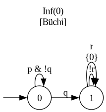

# aut2ltl

**Read an ω-automaton, get back an LTL formula.**

`aut2ltl` takes an [ω-automaton](https://en.wikipedia.org/wiki/%CF%89-automaton) in
the [HOA format](https://adl.github.io/hoaf/) and reconstructs a Linear Temporal
Logic formula that describes the **same language** — a readable formula for an
automaton you were handed. You can also pass an LTL/PSL formula directly (it is
translated to an automaton first, then reconstructed), which is handy for trying the
tool out.

It is a **best-effort** translator: on the inputs it handles it returns a verified
equivalent formula, and when it cannot, it tells you so rather than guessing (see
[Scope & honesty](#scope--honesty)).

## Quick start

You need three things on your system (they are *not* pip-installable):

- **Python 3**
- **[Spot](https://spot.lre.epita.fr/)** with its `spot` / `buddy` Python bindings
- **[GAP](https://www.gap-system.org/) 4.12+** with the **SgpDec** package — run
  `aut2ltl/kr/install.sh` once to set it up user-locally (`~/.gap/pkg`)

Then install the package itself:

```bash
pip install -e .          # provides `python3 -m aut2ltl` and the `aut2ltl` console script
```

### Example

Here is a small automaton from the test fixtures
([`tests/fixtures/motivating_example.hoa`](tests/fixtures/motivating_example.hoa)) —
the language *"`p` until `q`, and `r` infinitely often"*:

<p align="center"></p>

Hand it to the tool:

```console
$ python3 -m aut2ltl tests/fixtures/motivating_example.hoa
technique : sl+sl_driven
DAG nodes : 9
temporals : 3
tree nodes: 10
sharing   : 1.1x
build time: 0.002s
(p & !q) U (q & GFr)
```

The **formula** is printed on stdout; the **report** above it (which methods fired,
the formula's size, build time) goes to stderr. So in a pipeline you get just the
formula:

```bash
python3 -m aut2ltl tests/fixtures/motivating_example.hoa -q | ltlfilt --simplify
```

## Using it

The input is auto-detected as a HOA file or an LTL/PSL formula; force it with
`--ltl` / `--hoa`.

```bash
python3 -m aut2ltl 'G(p -> (q U r))'           # an LTL/PSL formula in
python3 -m aut2ltl model.hoa                    # a HOA automaton file in
python3 -m aut2ltl model.hoa -q -o out.ltl      # -q: formula only; -o: to a file
python3 -m aut2ltl model.hoa --list-options     # every -O knob, its default and doc
python3 -m aut2ltl --help
```

The reconstructed formula is a **hash-consed DAG**: it shares repeated sub-formulas,
and successful outputs are often highly tail-redundant, so the DAG stays compact even
when the flat string is large. By default a large formula is printed only up to a
size gate (raise it with `--flatten-limit N`), or export the DAG itself:

```bash
python3 -m aut2ltl model.hoa --dag | dot -Tpng -o dag.png
```

Fine-tune any declared option with `-O key=value` (see `--list-options`).

## Samples

A reference run of the curated corpus is committed under
[`tests/logs/reference/`](tests/logs/reference/) (per-formula CSVs + a summary) — a
quick sense of what the tool produces across a range of inputs.

## Project structure

`aut2ltl` is a **portfolio**: most modules are *translators* (a `Language` in, an
LTL result out) and the portfolio composes them, taking the best answer at each step.

```
aut2ltl/
  language.py     the input wrapper: cached, cleaned, language-equivalent automaton views
  result.py       LTLResult — a formula (DAG) or a decline, plus which methods contributed
  __main__.py     the command-line front end  (python3 -m aut2ltl)
  kr/             the systematic construction (Krohn-Rhodes cascade; see kr/README.md)
  daisy/          the self-loop "daisy" peel — a pure local translator
  decomp/         (de)composition approaches, one isolated subpackage each:
                  scc / strength / acceptance / inv
  partscc/        the single-terminal-SCC leaf translator
  sl/             the heuristic self-loop engine
  ltl/            LTL primitives, metrics, printers, simplifiers
  portfolio/      the combinators that assemble the translators
tests/            survey (the correctness gate), fixtures, per-engine tests
docs/             algorithm notes, the construction log, figures
```

## Scope & honesty

Translating an automaton to LTL is hard: the construction is exponential in several
directions, and some ω-languages are simply **not LTL-definable** at all (ω-automata
are strictly more expressive than LTL). `aut2ltl` does not pretend otherwise — every
translator is *language-faithful or it declines*, so a result you get back is an
honest one, and an input out of reach is reported as a decline rather than a wrong
formula.

## Algorithms

The systematic core follows Boker, Lehtinen & Sickert, *"On the Translation of
Automata to Linear Temporal Logic"* (FoSSaCS 2022), via a Krohn-Rhodes holonomy
cascade decomposition (SgpDec + GAP) — to our knowledge the first practical
implementation of that construction. It is complemented by a portfolio of additional,
mostly original methods that handle structured fragments directly.

> This material is **unpublished**. Please give us time to write the paper before
> building on this prototype. Feedback and collaboration are very welcome —
> contact **Yann.Thierry-Mieg@lip6.fr** or open a GitHub issue. As a last resort,
> cite this repository.

## License

Distributed under the **GNU General Public License v3.0** (see [`LICENSE`](LICENSE)).

© 2026 Yann Thierry-Mieg, LIP6, Sorbonne Université, CNRS.
