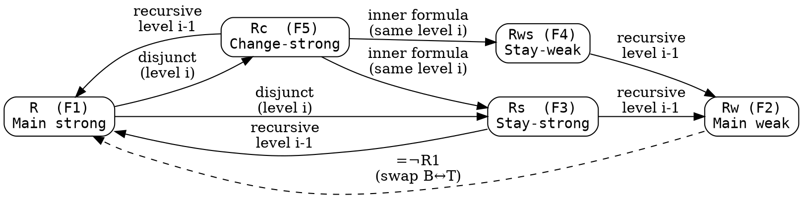
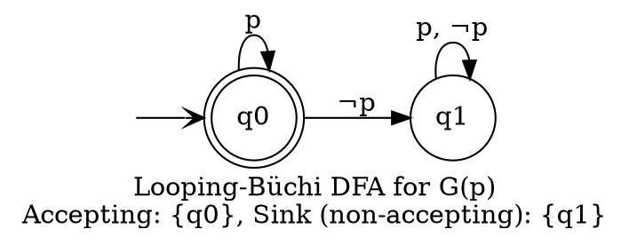

# Translation of Automata to LTL: Algorithm Reference & Implementation Guide
### Based on: Boker, Lehtinen, Sickert — "On the Translation of Automata to Linear Temporal Logic" (FoSSaCS 2022)

---

## PART I — FORMAL DEFINITIONS AND ALGORITHM

---

## 1. LTL: Syntax, Semantics, and Metrics

### 1.1 Syntax

Let `AP` be a finite set of atomic propositions. LTL formulas are built by:

```
φ ::= true | a (a ∈ AP) | ¬φ | φ ∧ ψ | X φ | φ U ψ
```

Standard abbreviations:
- `false` = `¬true`
- `φ ∨ ψ` = `¬(¬φ ∧ ¬ψ)`
- `F φ` = `true U φ`  (eventually)
- `G φ` = `¬F¬φ`     (always)
- `φ R ψ` = `¬(¬φ U ¬ψ)` (release; the weak dual of U)

### 1.2 Semantics

Words are sequences over `Σ = 2^AP`. For `w ∈ Σ^ω` (infinite) or `w ∈ Σ^+` (finite):

| Formula | Satisfaction condition |
|---|---|
| `true` | always |
| `a` | `a ∈ w[0]` |
| `¬φ` | `w ⊭ φ` |
| `φ ∧ ψ` | `w ⊨ φ` and `w ⊨ ψ` |
| `X φ` | `|w| > 1` and `w[1..] ⊨ φ` |
| `φ U ψ` | `∃i ∈ [0..|w|). w[i..] ⊨ ψ` and `∀j < i. w[j..] ⊨ φ` |

### 1.3 Structural Metrics

Given a formula `φ`:

- **length** `|φ|`: number of nodes in the syntax tree
- **size**: number of nodes in a DAG representation (shared subformulas)
- **temporal nesting depth** `depth(φ)`:
  ```
  depth(true)     = 0
  depth(a)        = 0       (atomic proposition)
  depth(¬φ)       = depth(φ)
  depth(φ ∧ ψ)    = max(depth(φ), depth(ψ))
  depth(X φ)      = depth(φ) + 1
  depth(φ U ψ)    = max(depth(φ), depth(ψ)) + 1
  ```

---

## 2. The LTL Syntactic Future Hierarchy

Due to Chang, Manna, Pnueli [1992]. Each level is a syntactic class of LTL formulas over infinite words.

| Level | Class | Closed under | Generators |
|---|---|---|---|
| `Σ₀ = Π₀ = Δ₀` | Propositional | `∧, ∨` | atoms `a`, negated atoms `¬a` |
| `Σ₁` | co-safety | `∧, ∨, X, U` | `Π₀` and `¬(Π₁)` |
| `Π₁` | safety | `∧, ∨, X, R` | `Σ₀` and `¬(Σ₁)` |
| `Δ₁` | obligation | `∧, ∨, ¬` | `Σ₁ ∪ Π₁` |
| `Σ₂` | recurrence | `∧, ∨, X, U` | `Π₁` and `¬(Π₂)` |
| `Π₂` | persistence | `∧, ∨, X, R` | `Σ₁` and `¬(Σ₂)` |
| `Δ₂` | reactivity | `∧, ∨, ¬` | `Σ₂ ∪ Π₂` |

**Key containments:** `Σ_i, Π_i ⊆ Δ_i ⊆ Σ_{i+1}, Π_{i+1}`

**Intuition:**
- `Σ₁` (co-safety): "something good happens" — formulas of shape `F(...)`
- `Π₁` (safety): "nothing bad happens" — formulas of shape `G(...)`
- `Π₂`: formulas like `GF(...)` (recurrence from the automaton perspective, safety from formula side)
- `Σ₂`: formulas like `FG(...)` (persistence from automaton, co-safety from formula side)

---

## 3. Automata Definitions

### 3.1 Deterministic Semiautomaton

A **deterministic semiautomaton** is `D = (Σ, Q, δ)` where:
- `Σ` is a finite alphabet
- `Q` is a finite non-empty set of states
- `δ: Q × Σ → Q` is the transition function

`δ` extends to words by `δ(q, ε) = q` and `δ(q, σw) = δ(δ(q, σ), w)`.

A **path** of `D` on word `w = σ₀σ₁…` is a sequence `q₀, q₁, …` with `δ(qᵢ, σᵢ) = q_{i+1}`.

### 3.2 Special Semiautomata

**Reset semiautomaton:** For every letter `σ ∈ Σ`, either
  1. `δ(q, σ) = q` for all `q ∈ Q` (identity on `σ`), or
  2. `∃ q₀ ∈ Q. ∀ q ∈ Q. δ(q, σ) = q₀` (constant map / reset to `q₀`)

**Counter-free semiautomaton:** For every state `q ∈ Q`, word `u ∈ Σ⁺`, and `n ≥ 1`:
```
δ(q, uⁿ) = q   ⟺   δ(q, u) = q
```
No non-trivial counting cycles. Equivalently: the transition monoid (syntactic monoid) is **aperiodic**.

### 3.3 Deterministic Automaton on Infinite Words

A **deterministic automaton** is `D = (Σ, Q, ι, δ, α)` where:
- `(Σ, Q, δ)` is a deterministic semiautomaton
- `ι ∈ Q` is the initial state
- `α` is an acceptance condition (see below)

A **run** of `D` on `w` is the unique path starting in `ι`.

Let `inf(r)` denote the set of states visited infinitely often along run `r`.

### 3.4 Acceptance Conditions

| Name | Form of `α` | Accepting iff |
|---|---|---|
| **Büchi** | `α ⊆ Q` | `α ∩ inf(r) ≠ ∅` |
| **coBüchi** | `α ⊆ Q` | `α ∩ inf(r) = ∅` |
| **Rabin** | `{(G₁,B₁),…,(Gₖ,Bₖ)}` | `∃i: Gᵢ ∩ inf(r) ≠ ∅ ∧ Bᵢ ∩ inf(r) = ∅` |
| **Muller** | `{M₁,…,Mₖ}`, each `Mᵢ ⊆ Q` | `∃i: inf(r) = Mᵢ` (exact set equality) |
| **Parity** | priority fn `p: Q → ℕ` | `min{ p(q) \| q ∈ inf(r) }` is even (min-parity) |
| **Weak** | Büchi `α` where each SCC is fully in or fully out of `α` | standard Büchi |
| **Looping-Büchi** | Büchi `α = Q \ {sink}` (one non-accepting sink) | run never reaches sink (infinitely often visits `α`) |
| **Looping-coBüchi** | coBüchi `α = Q \ {sink}` | run eventually stays in `α` (reaches sink only finitely often) |

### 3.5 Automaton Type ↔ LTL Hierarchy Correspondence

When the language is also LTL-definable:

| Automaton type | LTL fragment | Language class |
|---|---|---|
| Looping-Büchi DFA | `Π₁` | Safety |
| Looping-coBüchi DFA | `Σ₁` | Co-safety |
| Weak DFA | `Δ₁` | Obligation |
| Büchi DFA | `Π₂` | Recurrence |
| coBüchi DFA | `Σ₂` | Persistence |
| Rabin/Muller DFA | `Δ₂` | Reactivity |

---

## 4. Cascade Automata (Wreath Products)

### 4.1 Cascade Semiautomaton

A **cascaded semiautomaton** (cascade) over alphabet `Σ` with `n` levels is:

```
A = ⟨Σ, A₁, A₂, …, Aₙ⟩
```

where each `Aᵢ = (Σᵢ, Qᵢ, δᵢ)` is a semiautomaton with **extended alphabet**:
```
Σᵢ = Σ × Q₁ × Q₂ × … × Q_{i-1}

(so Σ₁ = Σ, Σ₂ = Σ × Q₁, Σ₃ = Σ × Q₁ × Q₂, etc.)
```

The key idea: level `i`'s transitions can depend on the current letter AND the current states of all lower levels.

A **reset cascade** is one where every `Aᵢ` is a reset semiautomaton.

### 4.2 Configurations

An **i-configuration** of `A` is a tuple:
```
S = ⟨q₁, q₂, …, qᵢ⟩  ∈  Q₁ × Q₂ × … × Qᵢ
```

- The **0-configuration** is the empty tuple `⟨⟩` (unique; the base case).
- Given an i-configuration `S` and a state `q_{i+1} ∈ Q_{i+1}`, we write `⟨S, q_{i+1}⟩` for the (i+1)-configuration.
- The word "configuration" alone means an n-configuration.

**Cascade transition** on letter `σ ∈ Σ`:
```
δ≤ᵢ(⟨q₁,…,qᵢ⟩, σ) = ⟨ δ₁(q₁, ⟨σ⟩),
                          δ₂(q₂, ⟨σ, q₁⟩),
                          …,
                          δᵢ(qᵢ, ⟨σ, q₁,…,q_{i-1}⟩) ⟩
```

A cascade `A` with n levels describes a standard semiautomaton `D_A` over `Σ`, whose states are all n-configurations and whose transition is `δ≤ₙ`. If each level has at most `j` states, `D_A` has at most `jⁿ` states.

### 4.3 Enter / Stay / Leave Sets (for Reset Cascades)

Fix level `i` and a state `q ∈ Qᵢ`. The **combined letters** at level `i` are elements of `Σᵢ = Σ × Q₁ × … × Q_{i-1}`.

For a combined letter `⟨σ, S⟩` where `S ∈ Q₁ × … × Q_{i-1}`:

```
Stay(q)  = { ⟨σ, S⟩ ∈ Σᵢ  |  δᵢ(q, ⟨σ,S⟩) = q }   (identity on q)
Enter(q) = { ⟨σ, S⟩ ∈ Σᵢ  |  δᵢ(r, ⟨σ,S⟩) = q  for ALL r ∈ Qᵢ }   (reset TO q)
Leave(q) = Σᵢ \ Stay(q)                               (leaves q to somewhere else)
```

**Key fact for reset semiautomata:** `Enter(q) ⊆ Stay(q)` — every resetting letter also stays at its target. A combined letter is either:
- In `Stay(q)` and `Stay(r)` for all `r` (identity letter), or
- In `Enter(q)` for exactly one `q` (reset letter)

### 4.4 Homomorphism to Cascade

A semiautomaton `(Σ, Q, δ)` is **homomorphic** to cascade `⟨Σ, A₁, …, Aₙ⟩` if there exists a partial surjective function:
```
h : Q₁ × … × Qₙ  →  Q
```
such that for all `σ ∈ Σ` and all n-configurations `S`:
```
δ(h(S), σ) = h(δ≤ₙ(S, σ))
```
(The cascade simulates `D` via `h`; `h` may be partial.)

### 4.5 The Krohn-Rhodes-Holonomy Decomposition

> **Proposition 6.** Every counter-free deterministic semiautomaton `D` with `n` states is homomorphic to a reset cascade `A` with:
> - at most `2ⁿ` levels
> - at most `2n` states per level
> - hence at most `(2n)^{2ⁿ}` configurations total (singly exponential in `n`)

This is implemented by the **Holonomy decomposition** (Eilenberg, adapted by Maler-Pnueli). In practice: use the `SgpDec` package in GAP.

### 4.6 Lifting Acceptance to the Cascade

Given `h: configs(A) → Q(D)`:

> **Proposition 7 (Büchi / coBüchi / Rabin).** If `D` is Büchi/coBüchi/Rabin, define `D'` on semiautomaton `A` by taking preimages under `h`:
> - Büchi: `α' = h⁻¹(α) = { C ∈ configs | h(C) ∈ α }`
> - coBüchi: same
> - Rabin: for each pair `(Gᵢ, Bᵢ)` in `α`, use `(h⁻¹(Gᵢ), h⁻¹(Bᵢ))`; same number of pairs.

> **Proposition 8 (Muller).** If `D` is Muller with `n` states, and `A` has `m` configurations, then `D'` on semiautomaton `A` has a Muller condition with at most `2^{O(mn)}` acceptance sets, constructed as follows:
>
> For each Muller set `M = {q₁,…,qₗ} ∈ α` of `D`:
> - For each choice of subsets `Gᵢ ⊆ h⁻¹(qᵢ)` (one per state in M), define the cascade Muller set `G = G₁ ∪ … ∪ Gₗ`
> - `G ∈ α'` iff `run r' on cascade is accepting according to M`: visits every `C ∈ G` infinitely often and every `C ∉ G` with `h(C) ∈ M` finitely often, and every `C` with `h(C) ∉ M` finitely often.
>
> Concretely: `α'` consists of all non-empty subsets `G ⊆ configs` such that `{ h(C) | C ∈ G } ∈ α`.

---

## 5. LTL Reachability Formulas for Reset Cascades

This section gives the core recursive construction. Fix:
- `AP`, `Σ = 2^{AP}`
- A reset cascade `A = ⟨Σ, A₁, …, Aₙ⟩`

All formulas take configurations and LTL formulas as parameters, and produce LTL formulas.

### 5.0 Overview of the Five Formulas

| # | Name | Notation | Top-level state | Semantics |
|---|---|---|---|---|
| 1 | Main strong | `R(S, B, β, T, τ)` | any | not reaching B(β) until reaching T(τ) |
| 2 | Main weak (dual) | `Rw(S, B, β, T, τ)` | any | reaching T(τ) releases not reaching B(β) |
| 3 | Stay-strong | `Rs(⟨S,s⟩, ⟨B,b⟩, β, ⟨T,t⟩, τ)` | unchanged (s fixed) | same as 1 but path stays in s |
| 4 | Stay-weak | `Rws(⟨S,s⟩, ⟨B,b⟩, β, ⟨T,t⟩, τ)` | unchanged (s fixed) | same as 2 but path stays in s |
| 5 | Change-strong | `Rc(⟨S,s⟩, ⟨B,b⟩, β, ⟨T,t⟩, τ)` | changes (s ≠ t) | not reaching B(β) until reaching T(τ) and leaving s |

**Parameters:**
- `S, B, T`: i-configurations (or (i-1)-configurations when used inside the recursive definitions)
- `s, b, t ∈ Qᵢ`: states at the top level
- `β, τ`: LTL formulas (the "bad" trigger and "target" trigger)

**Syntactic hierarchy membership (Lemma 5):** For `i ≥ 1`:
- `R(S, B, Πᵢ, T, Σᵢ)`, `Rs(⟨S,s⟩, ⟨B,b⟩, Πᵢ, ⟨T,t⟩, Σᵢ)`, `Rc(…, Πᵢ, …, Σᵢ) ∈ Σᵢ`
- `Rw(S, B, Σᵢ, T, Πᵢ)`, `Rws(…, Σᵢ, …, Πᵢ) ∈ Πᵢ`

### 5.1 Formal Semantics (Table 1)

Let `S, B, T` be i-configurations, `s, b, t ∈ Q_{i+1}` (when applicable), `β, τ` LTL formulas.

**Formula 1 — `R(S, B, β, T, τ)` — Main Strong:**
```
w ⊨ R(S, B, β, T, τ)  ⟺
  ∃i ≥ 0.  δ(S, w[0..i)) = T  ∧  w[i..] ⊨ τ
         ∧ ∀j ∈ [0..i). δ(S, w[0..j)) ≠ B  ∨  w[j..] ⊭ β
```
(Reach T satisfying τ, without passing through B satisfying β first)

**Formula 2 — `Rw(S, B, β, T, τ)` — Main Weak:**
```
w ⊨ Rw(S, B, β, T, τ)  ⟺
  ∀i ≥ 0.  (δ(S, w[0..i)) = B  ∧  w[i..] ⊨ β)
          →  ∃j ∈ [0..i). δ(S, w[0..j)) = T  ∧  w[j..] ⊨ τ
```
(Every time B-with-β is hit, T-with-τ was already hit before)

**Formula 3 — `Rs(⟨S,s⟩, ⟨B,b⟩, β, ⟨T,t⟩, τ)` — Stay-Strong:**
```
w ⊨ Rs(⟨S,s⟩, ⟨B,b⟩, β, ⟨T,t⟩, τ)  ⟺
  ∃i ≥ 0.  δ(⟨S,s⟩, w[0..i)) = ⟨T,t⟩  ∧  w[i..] ⊨ τ
         ∧ ∀j ∈ [0..i). δ(⟨S,s⟩, w[0..j)) ≠ ⟨B,b⟩  ∨  w[j..] ⊭ β
         ∧ ∀j ∈ [0..i). ⟨w[j], δ(S, w[0..j))⟩ ∈ Stay(s)
```
(Like Formula 1, but the top-level state s never changes along the path)

**Formula 4 — `Rws(⟨S,s⟩, ⟨B,b⟩, β, ⟨T,t⟩, τ)` — Stay-Weak:**
```
w ⊨ Rws(⟨S,s⟩, ⟨B,b⟩, β, ⟨T,t⟩, τ)  ⟺
  ∀i ≥ 0.
    ( (δ(⟨S,s⟩, w[0..i)) = ⟨B,b⟩  ∧  w[i..] ⊨ β)
     ∨ (i > 0  ∧  ⟨w[i-1], δ(S, w[0..i-1))⟩ ∈ Leave(s)) )
    →  ∃j ∈ [0..i). δ(⟨S,s⟩, w[0..j)) = ⟨T,t⟩  ∧  w[j..] ⊨ τ
```
(Every time ⟨B,b⟩-with-β is hit OR the path leaves s, ⟨T,t⟩-with-τ was already hit)

**Formula 5 — `Rc(⟨S,s⟩, ⟨B,b⟩, β, ⟨T,t⟩, τ)` — Change-Strong:**
```
w ⊨ Rc(⟨S,s⟩, ⟨B,b⟩, β, ⟨T,t⟩, τ)  ⟺
  ∃i₁, i₂ ≥ 0.
     δ(⟨S,s⟩, w[0..i₁)) = ⟨T,t⟩  ∧  w[i₁..] ⊨ τ
   ∧ ∃j₁ ∈ [0..i₁). ⟨w[j₁], δ(S, w[0..j₁))⟩ ∈ Enter(t)
   ∧ ⟨w[i₂], δ(S, w[0..i₂))⟩ ∈ Leave(s)
   ∧ ∀j₂ ∈ [0..max(i₁-1, i₂)].
       δ(⟨S,s⟩, w[0..j₂)) ≠ ⟨B,b⟩  ∨  w[j₂..] ⊭ β
```
(Reach ⟨T,t⟩ via entering t, while leaving s, without hitting ⟨B,b⟩-with-β)

---

### 5.2 Recursive Formula Definitions

All formulas at level i are defined using formulas at level i-1. The base case is level 0.

#### Formula 1: `R(S, B, β, T, τ)` at level i

```
R(S, B, β, T, τ)  =

  if level(S) = 0:                    ← base case
      (¬β) U τ

  else  [write S = ⟨S', s⟩, B = ⟨B', b⟩, T = ⟨T', t⟩]:
      Rs(S', s, B', b, β, T', t, τ)  ∨  Rc(S', s, B', b, β, T', t, τ)
```

#### Formula 2: `Rw(S, B, β, T, τ)` at level i

```
Rw(S, B, β, T, τ)  =  ¬ R(S, T, τ, B, β)
```
(Swap the roles of (B,β) and (T,τ) and negate)

---

#### Formula 3: `Rs(S, s, B, b, β, T, t, τ)` at level i  (i ≥ 1)

First, define the **>0 variant** `Rs0(S, s, B, b, β, T, t, τ)` which handles paths of length ≥ 1:

```
Rs0(S, s, B, b, β, T, t, τ) =

  ⋁  over all ⟨σ, T'⟩ ∈ Stay(s)  such that  δ_{i-1}(T', σ) = T  [and t = s implied]
  [
      R(S, S, false, T', σ ∧ X τ)                    ← reach T' freely (no bad)

    ∧ ∧ over all ⟨η, L⟩ ∈ Leave(s):
          Rw(S, L, η, T', σ ∧ X τ)                   ← weakly avoid every leaving letter

    ∧ ∧ over all ⟨ρ, B'⟩ ∈ Stay(s) with δ_{i-1}(B', ρ) = B  [and b = s implied]:
          R(S, B', ρ ∧ X β, T', σ ∧ X τ)             ← avoid predecessors of B
  ]
```

**Explanation of Rs0:**  
The inner disjunction picks the "last step" letter `⟨σ, T'⟩` (the combined letter that takes level-(i-1) from `T'` to `T`, while level-i stays in `s`). Before this step, the level-(i-1) part goes from `S` to `T'`:
- Without detour through `S` (via the "no bad" constraint with `false`),
- While all potential "leave-s" letters are safely avoided (weak avoid),
- While all predecessors of the bad config `⟨B', s⟩` (those `B'` such that reading `ρ` from `B'` enters `B`) are avoided.

Then `Rs` handles the edge cases at `i = 0` (i.e., whether the starting config equals B or T):

```
Rs(S, s, B, b, β, T, t, τ) =

  if ⟨S,s⟩ ≠ ⟨B,b⟩ and ⟨S,s⟩ ≠ ⟨T,t⟩:
      Rs0(S, s, B, b, β, T, t, τ)

  if ⟨S,s⟩ ≠ ⟨B,b⟩ and ⟨S,s⟩ = ⟨T,t⟩:
      Rs0(S, s, B, b, β, T, t, τ)  ∨  τ           ← also satisfied immediately

  if ⟨S,s⟩ = ⟨B,b⟩ and ⟨S,s⟩ ≠ ⟨T,t⟩:
      Rs0(S, s, B, b, β, T, t, τ)  ∧  ¬β          ← must not satisfy β now

  if ⟨S,s⟩ = ⟨B,b⟩ and ⟨S,s⟩ = ⟨T,t⟩:
      (Rs0(S, s, B, b, β, T, t, τ)  ∧  ¬β)  ∨  τ  ← avoid β or satisfy τ immediately
```

---

#### Formula 4: `Rws(S, s, B, b, β, T, t, τ)` at level i  (i ≥ 1)

**Rws0 (the >0 variant) — two clauses OR-ed (critical difference from Rs0):**

```
Rws0(S, s, B, b, β, T, t, τ) =

  -- Line (1): reach T' *conditionally* (only if a blocking event fires first)
  (  ⋁_{⟨σ,T'⟩ ∈ Stay(s), δ_{i-1}(T',σ)=T}
     [
         ∧_{⟨η,L⟩ ∈ Leave(s)}            Rw(S, L, η,      T', σ ∧ Xτ)
       ∧ ∧_{⟨ρ,B'⟩ ∈ Stay(s), δ_{i-1}(B',ρ)=B}  Rw(S, B', ρ∧Xβ, T', σ ∧ Xτ)
     ]
  )

  ∨

  -- Line (2): "stay in s forever" without any blocking event *ever* firing
  -- (the formal expression of weak/Release semantics: vacuous satisfaction)
  (
      ∧_{⟨η,L⟩ ∈ Leave(s)}            Rw(S, L, η,      S, false)
    ∧ ∧_{⟨ρ,B'⟩ ∈ Stay(s), δ_{i-1}(B',ρ)=B}  Rw(S, B', ρ∧Xβ, S, false)
  )
```

**Key corrections vs. naive dual of R3:**
- No "freely reach T' from S" (R1(S, S, false, T', ...)) conjunct in line (1). Reaching T' is conditional on a Leave or bad-predecessor firing first.
- Line (2) has *no analogue whatsoever* in Rs0. It encodes "the path drifts in s indefinitely with no Leave ever firing and no bad-predecessor ever firing."
- `Rw(S, L, η, S, false)` means "L is never reached while satisfying η" (i.e. ¬R(S, S, false, L, η)).

Then the outer `Rws` (four cases) — **case 4 differs from Rs**:

```
Rws(S, s, B, b, β, T, t, τ) =

  if ⟨S,s⟩ ≠ ⟨B,b⟩  and  ⟨S,s⟩ ≠ ⟨T,t⟩:   Rws0(...)

  if ⟨S,s⟩ ≠ ⟨B,b⟩  and  ⟨S,s⟩ = ⟨T,t⟩:   Rws0(...) ∨ τ

  if ⟨S,s⟩ = ⟨B,b⟩  and  ⟨S,s⟩ ≠ ⟨T,t⟩:   Rws0(...) ∧ ¬β

  if ⟨S,s⟩ = ⟨B,b⟩  and  ⟨S,s⟩ = ⟨T,t⟩:   (Rws0(...) ∨ τ) ∧ ¬β
                                               ← NOT the strong form (Rws0 ∧ ¬β) ∨ τ
```

**Why the precedence in case 4 matters (S=B ∧ S=T):**
- Strong (Rs): τ rescues even if β holds at 0 (immediate target overrides).
- Weak (Rws): ¬β is a *global side-condition*. Even immediate τ does not allow β to hold at the starting position. The universal (Release) nature forbids the bad trigger "for free" at the start.

**Downstream: R5 line (2) must call Rws with *swapped* roles**

Correct (as required by the paper for "avoid entering b"):

```
Rws( R'', b,   T, t, τ,   B, b, β )
      ↑         ↑              ↑
   source    "bad" role gets original (T,t,τ)
             "target" role gets original (B,b,β)
```

This means: after a hypothetical entry into b, we weakly require hitting the bad ⟨B,b⟩(β) *before* the outer target ⟨T,t⟩(τ) can be reached while staying in b. Non-swapped calls `Rws(..., B, b, β, T, t, τ)` are incorrect.

(The high-level semantics of Formula 4 already appears correctly in Section 5.1 / Table 1; the errors were only in the recursive expansion and the Python sketch below.)

---

#### Formula 5: `Rc(S, s, B, b, β, T, t, τ)` at level i  (i ≥ 1)  [s ≠ t]

This formula requires the level-i state to change from `s` to `t`. It has three components, all AND-ed together.

Let `T'' = δ_{i-1}(T', σ)` denote the level-(i-1) configuration immediately after entering `t`.

**Line (1): Find the entry point into `t`**

```
⋁  over all ⟨σ, T'⟩ ∈ Enter(t):
[
    R(S, S, false, T', σ ∧ X( Rs(T'', t, B, b, β, T, t, τ) ))

    ∧

    ∧ over all ⟨η, R⟩ ∈ Enter(b):          ← Line (2): avoid entering b
        R(S,
          R,
          η ∧ X( Rws(R'', b, T, t, τ, B, b, β) ),
          T',
          σ ∧ X( Rs(T'', t, B, b, β, T, t, τ) ))
]
```

where `R'' = δ_{i-1}(R, η)`.

**Explanation of Lines (1)+(2):**
- For each `⟨σ, T'⟩ ∈ Enter(t)`: "we will reach level-(i-1) configuration `T'` just before reading `σ`, which resets level-i to `t`."
- After entering `t` (i.e., after reading `σ`), we are in configuration `⟨T'', t⟩` and must reach `⟨T, t⟩` while staying in `t` (using `Rs`).
- Line (2) ensures we don't accidentally enter `b` before reaching `T'`. For each potential "enter-b" letter `⟨η, R⟩`: if we ever pass through `R` while the next word would enter `b` AND be stuck there (checked by the `Rws` formula), we require this happens AFTER already reaching `T'`.

  **Critical (swapped roles):** The Rws call here intentionally swaps the "target" and "bad" roles relative to the outer formula (see exact call site in the R5 Python sketch below, and the dedicated note in the Formula 4 section). Non-swapped calls are incorrect. Rws is used (not R) because the avoidance is conditional/weak.

**Line (3): Ensure level-i state s is actually left**

```
∧

⋁  over all ⟨σ', L⟩ ∈ Leave(s):
    Rs(S, s, B, b, β, L, s,
        σ' ∧ (¬β  if  ⟨L,s⟩ = ⟨B,b⟩  else  true))
```

**Explanation of Line (3):**  
"From `⟨S,s⟩`, while staying in `s`, reach the level-(i-1) configuration `L` such that the next combined letter is `⟨σ', L⟩ ∈ Leave(s)` — the letter that will cause leaving `s`."  
This uses `Rs` because we want to stay in `s` up to (and including) configuration `⟨L, s⟩`, at which point `σ'` triggers the exit. The condition `¬β` is added if `⟨L,s⟩ = ⟨B,b⟩` (the exit point IS the bad config, so β must not hold there).

---

### Audit & Validation Notes for R4 (Rws) and R5 line (2) (paper pages 11–12)

The high-level semantics (Section 5.1 / Table 1) for all five formulas are faithful. The recursive definitions above for R1–R3 and R5 line (1)+(3) are accurate. **R4 (Rws + Rws0) and the R5 line (2) call site required the following precise corrections** (three structural errors in earlier sketches of Rws0 + case handling + role swap):

**Error 1 (Rws0 missing "stay-forever" / line 2):** Rs0 is a single disjunct over last-step letters + three conjuncts. Rws0 is *two* clauses OR-ed; line (2) ("drift forever in s with no Leave or bad-predecessor ever firing") has no Rs0 analogue and is essential for weak semantics.

**Error 2 (Rws0 line (1) must not contain free reach):** Unlike Rs0, there is no `R(S, S, false, T', ...)` conjunct. Reaching T' is only required *if* a blocking event fires first. The two Rw conjuncts encode the conditional.

**Error 3 (Case 4 operator precedence):** For S=B and S=T the weak form is `(Rws0 ∨ τ) ∧ ¬β` (¬β is a global side-condition that even immediate τ cannot override). The strong form `(Rws0 ∧ ¬β) ∨ τ` is wrong for Rws.

**R5 line (2) swap requirement:** Must call Rws with swapped (B,b,β) as the "target" role and (T,t,τ) as the "bad" role (see corrected call site in the R5 sketch and the dedicated note in the Formula 4 section). Non-swapped is a bug.

**Recommended validation paths (use before/during implementation; no reliance on 1L cases like Fa which often bypass R4):**

- **Path A (semantic grounding test, immediate):** 1-level reset cascade, s=0/b=1/t=0 (S=T but B differs at top). Enumerate short words (including pure-stay "ppppp…"); check truth table of Formula 4 Table-1 semantics vs. candidate impl. The "drift forever" case is the canary.
- **Path B (duality test):** When Stay(s) letters have trivial lower transitions, line (1) becomes vacuous → Rws0 should reduce to line (2) alone → overall formula should simplify (via Spot) to G(¬(blocking condition)).
- **Path C (code audit checklist for the weak stay impl):**
  1. Does the >0 variant have a Line-2 disjunct ("stay forever")?
  2. Does Line-1 *omit* the free-reach R1(S,S,false,...) term?
  3. Do the bad-predecessor avoids use Rw (not R)?
  4. Is outer case 4 exactly `(core ∨ τ) ∧ ¬β` (not the strong form)?
  5. In R5 line (2), is Rws called with swapped roles (B,b,β as target; T,t,τ as bad)?
- **Path D (better canary than Fa):** Use a Büchi/coBüchi case whose LTL sits in Π₂/Σ₂ and exercises Fin(C) (which uses reach-with-tau forms depending on inner Rws for last-visit postponement), e.g. `G(p ∨ F q)`. If the roundtrip (Spot equiv) fails after implementing R4, Rws0 is likely the culprit. 1L looping-coBüchi cases like Fa/Ga often only exercise R1 via shortcuts and do not stress R4.

These notes were incorporated directly from detailed paper-page-11-12 analysis to ensure the reference is accurate on the weak formulas and their use inside R5.

---

### 5.3 Summary of Recursive Dependencies



**Important:** There is NO circular dependency. `R3, R4, R5` at level `i` call `R1, R2` at level `i-1`. `R5` at level `i` calls `R3, R4` at the same level `i`, but `R3, R4` at level `i` only call `R1, R2` at level `i-1`. The recursion is well-founded by strictly decreasing level.

---

## 6. From Cascade to LTL: The Acceptance Condition

### 6.1 Shorthands

Given a cascade `A` with initial configuration `ι`:

```
ι  ~~→  C     =  R(ι, C, false, C, true)
                 "reach C from ι (freely, no bad constraint)"

C  >0~~→  C   =  ⋁_{σ ∈ Σ}  ( σ  ∧  X( R(δ(C, σ), C, false, C, true) ) )
                 "reach C from C via at least one step"
```

Note: `R(ι, C, false, C, true)` uses `β = false` which is never satisfied, so the "bad" constraint vanishes; and `τ = true` which is always satisfied. This simplifies to "reach C from ι without any restriction."

### 6.2 The Fin(C) Formula (Lemma 7)

For any configuration `C` of the cascade:

```
Fin(C)  =  ¬(ι ~~→ C)  ∨  (ι ~~→ C)(¬(C >0~~→ C))
```

**Semantics:** `w ⊨ Fin(C)` iff the run of `A` on `w` starting in `ι` visits `C` **finitely often**.

**Proof sketch:**
- `¬(ι ~~→ C)`: `C` is never visited at all.
- `(ι ~~→ C)(¬(C >0~~→ C))`: there is a LAST visit to `C` (reach `C` once, then `C` is never re-entered from itself).

**Hierarchy:** `Fin(C) ∈ Σ₂`  
(Both `ι~~→C` and `C>0~~→C` are in `Σ₁` by Lemma 5, so their negations are in `Π₁`, and the outer formula structure puts everything in `Σ₂`.)

---

### 6.3 Main Theorem (Theorem 2): Full LTL Formula

> **Theorem 2.** Every counter-free deterministic ω-regular automaton `D` over `2^{AP}` with `n` states is equivalent to an LTL formula `φ` over `AP` with:
> - **temporal nesting depth** in `O(2^{2ⁿ})`
> - **length** in `2^{2^{O(2ⁿ)}}`

The acceptance-condition-specific constructions are:

#### Case 1: D is a **Muller** automaton  →  `φ ∈ Δ₂`

```
φ  =  ⋁_{G ∈ α'}  [ ∧_{C ∈ G} ¬Fin(C)  ∧  ∧_{C ∉ G} Fin(C) ]
```

where `α'` is the Muller condition on the cascade `D'` (from Prop. 8).  
Each `Fin(C) ∈ Σ₂`, and the Boolean combination is in `Δ₂`.

#### Case 2: D is a **coBüchi** automaton  →  `φ ∈ Σ₂`

```
φ  =  ∧_{C : h(C) ∈ α}  Fin(C)
```

Conjunction of `Fin(C)` for all configurations mapping to coBüchi-accepting states.

#### Case 3: D is a **Büchi** automaton  →  `φ ∈ Π₂`

Complement: convert to coBüchi, apply Case 2, negate:
```
φ  =  ¬( coBüchi-formula for the complement )
```

#### Case 4: D is a **Weak** automaton  →  `φ ∈ Δ₁`

For each accepting SCC `G ⊆ Q`, let `G'` be all states reachable FROM `G` but NOT in `G`. Let `H = h⁻¹(G)`, `H' = h⁻¹(G')`:

```
φ_G  =  ( ⋁_{C ∈ H} ι ~~→ C )  ∧  ( ∧_{C' ∈ H'} ¬(ι ~~→ C') )

φ  =  ⋁_{G : accepting SCC of D}  φ_G
```

This captures: "eventually end up in the accepting SCC G."

#### Case 5: D is a **Looping-coBüchi** automaton  →  `φ ∈ Σ₁`

Let `sink ∈ Q` be the unique non-accepting sink. Let `S = h⁻¹(sink)`:

```
φ  =  ⋁_{C ∈ S}  ( ι ~~→ C )
```

"Eventually reach the sink." Each `ι ~~→ C ∈ Σ₁`, so their disjunction is in `Σ₁`.

#### Case 6: D is a **Looping-Büchi** automaton  →  `φ ∈ Π₁`

Dual of Case 5:

```
φ  =  ¬( ⋁_{C ∈ S}  (ι ~~→ C) )   =   ∧_{C ∈ S}  ¬(ι ~~→ C)
```

"Never reach the sink." In `Π₁` (safety).

---

## 7. Complexity Summary

### 7.1 Unary Alphabet (Tight Bounds)

| Automaton → LTL | Size blow-up |
|---|---|
| Deterministic finite automaton | `Θ(n)` (linear) |
| Nondeterministic finite automaton | `Θ(n²)` (quadratic) |
| Alternating finite automaton | `Θ(2ⁿ)` (exponential) |

### 7.2 General Alphabet (Main Results)

For counter-free deterministic ω-automata with `n` states:

| Metric | Bound |
|---|---|
| Temporal nesting depth of `φ` | `O(2^{2ⁿ})` (double exponential) |
| Length of `φ` | `2^{2^{O(2ⁿ)}}` (triple exponential) |
| Known lower bound | none above linear (open!) |

**The depth bound** comes from the cascade having `m = 2ⁿ` levels and depth satisfying `depth(ζ) ≤ d + 3ⁱ`, giving `depth(Fin(C)) ∈ O(3^m) = O(2^{2ⁿ})`.

**The length bound** comes from `|ζ| ≤ l · (10|Σ|^{2n})^{4ⁱ}` (doubly exponential in levels).

---

## 8. Worked Example: G(p)

Consider `D` = the looping-Büchi DFA recognizing `G(p)`:



**Semiautomaton:** `D_sem = ({p, ¬p}, {q₀, q₁}, δ)` with:
- `δ(q₀, p) = q₀`, `δ(q₀, ¬p) = q₁` (reset to q₁)
- `δ(q₁, p) = q₁`, `δ(q₁, ¬p) = q₁`

**Counter-free check:** `δ(q₀, pⁿ) = q₀` iff `δ(q₀, p) = q₀` ✓. No non-trivial cycles. ✓

**Cascade:** This semiautomaton IS already a 1-level reset cascade `A = ⟨Σ, A₁⟩`:
- Level 1: `A₁ = (Σ × {⟨⟩}, {q₀, q₁}, δ₁)` (since `Σ₁ = Σ × Q₀ = Σ × {⟨⟩} ≅ Σ`)
- `¬p` is a reset letter (resets everything to `q₁`); `p` is the identity letter.

**Enter / Stay / Leave at level 1:**
```
Stay(q₀)  = {p}        Enter(q₀)  = ∅
Stay(q₁)  = {p, ¬p}   Enter(q₁)  = {¬p}
Leave(q₀) = {¬p}       Leave(q₁)  = ∅
```

**Homomorphism:** `h(⟨q₀⟩) = q₀`, `h(⟨q₁⟩) = q₁` (trivial identity).

**Muller sets of original automaton:** `α = {{q₀}}` (the only accepting SCC is `{q₀}`).

**Case: Looping-Büchi** (Case 6 of Theorem 2):

Let `S = h⁻¹(q₁) = {⟨q₁⟩}` (configurations mapping to sink):

```
φ  =  ¬( ι ~~→ ⟨q₁⟩ )
```

**Computing `ι ~~→ ⟨q₁⟩`:**  
`ι = ⟨q₀⟩` (initial configuration). `R(⟨q₀⟩, ⟨q₁⟩, false, ⟨q₁⟩, true)` at level 1.

Level 1 means `R = Rs ∨ Rc`. Since the target is `⟨q₁⟩` and starting state is `q₀`:
- `Rs` (stay in `q₀`) cannot reach `⟨q₁⟩` while staying in `q₀` (since the only way to reach `q₁` is to leave `q₀` via `¬p`) — gives `false`.
- `Rc` (change from `q₀` to `q₁`):
  - `Enter(q₁) = {¬p}`, so `T' = ⟨⟩` (the 0-configuration), `σ = ¬p`.
  - Line (1): `R(⟨⟩, ⟨⟩, false, ⟨⟩, ¬p ∧ X(Rs(…)))` at level 0 = `(¬false) U (¬p ∧ X(true))` = `F(¬p)`.

So `ι ~~→ ⟨q₁⟩ ≡ F(¬p)`.

**Result:**

```
φ  =  ¬ F(¬p)  =  G(p)   ✓
```

The formula `G(p) ∈ Π₁` as predicted by Theorem 2 for looping-Büchi.

---

---

## PART II — PRACTICAL IMPLEMENTATION GUIDE

---

## 9. Toolchain Overview

```dot
digraph toolchain {
    rankdir=LR;
    node [shape=box, style=rounded];

    A  [label="LTL formula\n(or ω-reg expression)"];
    B  [label="Spot\n(Python API)\nDeterministic Parity Aut.\n(DPA)"];
    C  [label="Semiautomaton\nextraction\n(transformations on Q)"];
    D  [label="GAP + SgpDec\nHolonomy decomposition\n→ Reset cascade"];
    E  [label="Cascade data\n(levels, states,\ntransitions, h)"];
    F  [label="Python\nFormula builder\n(recursive)"];
    G  [label="LTL formula φ\n(as Spot formula\nobject)"];

    A -> B [label="spot.translate(...)"];
    B -> C [label="extract δ\nper letter"];
    C -> D [label="GAP: trans. semigroup\n→ HolonomyDecomposition"];
    D -> E [label="parse\nGAP output"];
    E -> F [label="R1..R5\nFin(C)"];
    F -> G [label="combine\nper acc. condition"];
}
```



---

## 10. Step 1: DPA via Spot

```python
import spot

# Option A: from LTL formula
formula_str = "G(p -> F(q))"
aut = spot.translate(formula_str,
                     'deterministic',
                     'parity min odd',
                     'complete')

# Option B: from HOA file
aut = spot.automaton("myaut.hoa")

# Normalize
aut = spot.simplify_acceptance(aut)
aut.merge_edges()

print(f"States: {aut.num_states()}")
print(f"Init:   {aut.get_init_state_number()}")
print(f"Acc:    {aut.acc().to_text()}")
```

### Getting the accepting SCCs (= Muller sets of original automaton)

For a complete deterministic automaton, the reachable Muller sets correspond exactly to the accepting SCCs:

```python
scc_info = spot.scc_info(aut)

muller_sets = []
for i in range(scc_info.scc_count()):
    if scc_info.is_accepting_scc(i):
        M = frozenset(scc_info.states_of(i))
        muller_sets.append(M)
        print(f"Accepting SCC {i}: states = {set(M)}")

# For looping automata, also identify the sink
# Sink = non-accepting SCC with self-loops (absorbing)
sink_states = set()
for i in range(scc_info.scc_count()):
    if not scc_info.is_accepting_scc(i):
        for s in scc_info.states_of(i):
            sink_states.add(s)
```

---

## 11. Step 2: Semiautomaton Extraction

Extract the transition function as a mapping `letter → transformation on Q`:

```python
import buddy  # BDD library used by Spot

n = aut.num_states()
bdict = aut.get_dict()

# We need to enumerate all letters of Σ = 2^AP
# AP is encoded as BDD variables in Spot
# Enumerate transitions per source state

def get_all_transitions(aut):
    """Returns dict: (src, frozenset_letter) -> dst"""
    n = aut.num_states()
    transitions = {}

    for src in range(n):
        for edge in aut.out(src):
            # edge.cond is a BDD; enumerate its minterms
            cond_bdd = edge.cond
            for minterm in spot.enumerate_minterms(cond_bdd, bdict):
                key = (src, minterm)  # minterm is a frozenset of true APs
                assert key not in transitions, "Non-deterministic!"
                transitions[key] = edge.dst

    return transitions

def get_transformations(aut):
    """Returns dict: frozenset_letter -> list[int] (transformation on Q)"""
    n = aut.num_states()
    bdict = aut.get_dict()
    aps = [bdict.varnum(ap) for ap in bdict]
    all_letters = [frozenset(subset)
                   for subset in powerset(range(bdict.num_vars()))]
    
    trans = {}
    for letter in all_letters:
        t = [None] * n
        for src in range(n):
            for edge in aut.out(src):
                # Check if letter satisfies edge.cond
                if bdd_eval(edge.cond, letter, bdict):
                    t[src] = edge.dst
                    break
        trans[letter] = t
    return trans
```

**Note on alphabets:** Spot uses BDDs for transition labels. If `|AP| = k`, then `|Σ| = 2^k`. For small `k` (≤ 8 or so), explicit enumeration is feasible.

---

## 12. Step 3: Counter-Free Check

An automaton is counter-free iff its syntactic (transition) monoid is **aperiodic** — i.e., has no non-trivial subgroup.

### Via GAP/SgpDec:

```gap
# In GAP:
LoadPackage("sgpdec");

# Build the transformation semigroup
# f_sigma: Q -> Q is the transformation for letter sigma
# Use 1-based indexing (GAP convention: state 0 -> 1, state 1 -> 2, etc.)

f_p    := Transformation([1, 2]);    # p: identity (q0->q0, q1->q1)
f_notp := Transformation([2, 2]);    # ¬p: reset to q1 (both go to q1+1=2)

S := Semigroup(f_p, f_notp);

# Check aperiodicity
IsAperiodic(S);   # Returns true if counter-free

# Alternative: check that all subgroups are trivial
M := TransitionMonoid(S);
ForAll(MaximalSubgroups(M), g -> Order(g) = 1);
```

### Via Spot (approximate check):

For automata coming from LTL translation, counter-free is guaranteed.  
For general DPAs, you can check: if the automaton is a **deterministic weak automaton** or has **no SCCs with cycles involving different acceptance marks**, it may not be counter-free. The definitive check is via the syntactic monoid in GAP.

---

## 13. Step 4: Holonomy Cascade via GAP/SgpDec

```gap
LoadPackage("sgpdec");

# Build transformation semigroup from all letter transformations
# Collect all f_sigma for sigma in Sigma
f_p    := Transformation([1, 2]);
f_notp := Transformation([2, 2]);
S := Semigroup(f_p, f_notp);

# Holonomy decomposition
hd := HolonomyDecomposition(S);

# Inspect the result
NumberOfLevels(hd);          # Number of cascade levels
Display(hd);                 # Human-readable description

# For each level:
for level in [1..NumberOfLevels(hd)] do
    comp := ComponentsAtDepth(hd, level);
    Print("Level ", level, ": ", comp, "\n");
od;

# The homomorphism
# CascadeHomomorphism(hd) gives the function configs -> S-states
```

### What to extract from GAP output:

You need (for Python implementation):

1. **Number of levels** `n_levels`
2. **State sets** `Q_i` for each level `i = 1..n_levels`
3. **Transition function** `delta_i: Q_i × Sigma_i → Q_i` for each level
4. **Combined alphabet** `Sigma_i = Sigma × Q_1 × … × Q_{i-1}`
5. **Homomorphism** `h: Q_1 × … × Q_{n_levels} → Q_orig`

The SgpDec output gives components as groups/semigroups acting on state sets. The "skeleton" automaton at each level gives you the transitions.

### Python data structure for cascade:

```python
from dataclasses import dataclass
from typing import Dict, FrozenSet, List, Tuple, Optional

@dataclass
class CascadeLevel:
    states: List[int]           # Q_i
    # delta: (state, combined_letter) -> state
    # combined_letter = (sigma, s_1, ..., s_{i-1}) where s_j are states at level j
    delta: Dict[Tuple, int]

@dataclass
class Cascade:
    sigma: List[FrozenSet]       # Σ (list of letters as frozensets of APs)
    levels: List[CascadeLevel]   # levels[0] = level 1, etc.
    homomorphism: Dict[Tuple, int]  # n-config tuple -> original state

    def n_levels(self) -> int:
        return len(self.levels)

    def combined_letters(self, level_idx: int):
        """Enumerate all combined letters at level i = level_idx+1"""
        # Sigma_i = Sigma × Q_1 × ... × Q_{i-1}
        import itertools
        components = [self.sigma]
        for j in range(level_idx):
            components.append(self.levels[j].states)
        return list(itertools.product(*components))

    def stay(self, level_idx: int, state: int) -> List[Tuple]:
        """Letters ⟨σ, S⟩ at level i that keep state fixed"""
        result = []
        for cl in self.combined_letters(level_idx):
            if self.levels[level_idx].delta.get((state, cl), None) == state:
                result.append(cl)
        return result

    def enter(self, level_idx: int, state: int) -> List[Tuple]:
        """Letters ⟨σ, S⟩ at level i that reset to state from ANY state"""
        candidates = []
        for cl in self.combined_letters(level_idx):
            dests = set(self.levels[level_idx].delta.get((q, cl), None)
                        for q in self.levels[level_idx].states)
            if dests == {state}:  # constant map to state
                candidates.append(cl)
        return candidates

    def leave(self, level_idx: int, state: int) -> List[Tuple]:
        """Complement of Stay(state)"""
        stay_set = set(map(tuple, self.stay(level_idx, state)))
        return [cl for cl in self.combined_letters(level_idx)
                if tuple(cl) not in stay_set]
```

---

## 14. Step 5: Lift Acceptance Condition to Cascade

### For Looping-Büchi / Looping-coBüchi (simplest case):

```python
def get_sink_configs(cascade: Cascade, sink_orig_state: int) -> List[Tuple]:
    """All cascade configurations mapping to the sink state"""
    return [cfg for cfg, orig_state in cascade.homomorphism.items()
            if orig_state == sink_orig_state]
```

### For Büchi / coBüchi:

```python
def lift_buchi(cascade: Cascade, buchi_states: FrozenSet[int]) -> FrozenSet[Tuple]:
    """Cascade configurations corresponding to Büchi-accepting states"""
    return frozenset(cfg for cfg, s in cascade.homomorphism.items()
                     if s in buchi_states)
```

### For Muller (general case):

```python
from itertools import product as cartesian_product

def powerset(iterable):
    from itertools import chain, combinations
    s = list(iterable)
    return chain.from_iterable(combinations(s, r) for r in range(1, len(s)+1))

def lift_muller(cascade: Cascade,
                original_muller_sets: List[FrozenSet[int]]
                ) -> List[FrozenSet[Tuple]]:
    """
    Compute all cascade Muller sets corresponding to original Muller sets.
    A cascade set G is in α' iff {h(C) | C ∈ G} is in the original α.
    """
    all_configs = list(cascade.homomorphism.keys())
    cascade_muller_sets = []

    for M in original_muller_sets:
        # Preimage of M: configs mapping to states in M
        preimage = [C for C in all_configs if cascade.homomorphism[C] in M]

        # All non-empty subsets of preimage whose image under h exactly covers M
        for G_tuple in powerset(preimage):
            G = frozenset(G_tuple)
            image = frozenset(cascade.homomorphism[C] for C in G)
            if image == M:
                cascade_muller_sets.append(G)

    # Deduplicate
    return list(set(cascade_muller_sets))
```

**Warning:** This is exponential in `|preimage|`. For automata with up to 3 original states and a small cascade, it is feasible. For larger automata, prune by only considering G-sets that can actually be inf-sets of runs (i.e., correspond to SCCs in the cascade).

### Pruning strategy using SCCs:

```python
def cascade_sccs(cascade: Cascade) -> List[FrozenSet[Tuple]]:
    """Compute SCCs of the cascade transition graph"""
    import networkx as nx
    G = nx.DiGraph()
    all_configs = list(cascade.homomorphism.keys())
    G.add_nodes_from(all_configs)

    for cfg in all_configs:
        for sigma in cascade.sigma:
            # Compute δ_≤n(cfg, sigma)
            next_cfg = cascade_transition(cascade, cfg, sigma)
            G.add_edge(cfg, next_cfg)

    return [frozenset(scc) for scc in nx.strongly_connected_components(G)
            if len(scc) > 1 or has_self_loop(G, list(scc)[0])]


def lift_muller_with_scc_pruning(cascade, original_muller_sets):
    """Only consider Muller sets that correspond to actual cascade SCCs"""
    sccs = cascade_sccs(cascade)
    all_configs = list(cascade.homomorphism.keys())
    cascade_muller_sets = []

    for scc in sccs:
        image = frozenset(cascade.homomorphism[C] for C in scc)
        if image in original_muller_sets:
            cascade_muller_sets.append(scc)
    return cascade_muller_sets
```

---

## 15. Step 6: Build the LTL Reachability Formulas

Use Spot's formula API. **Critical:** use memoization — the same subformula appears many times.

```python
import spot
from functools import lru_cache

# --- Spot formula constructors ---
F_true  = spot.formula.tt()
F_false = spot.formula.ff()

def ap(name: str) -> spot.formula:
    return spot.formula.ap(name)

def And(*args) -> spot.formula:
    if not args: return F_true
    return spot.formula.And(list(args))

def Or(*args) -> spot.formula:
    if not args: return F_false
    return spot.formula.Or(list(args))

def Not(f: spot.formula) -> spot.formula:
    return spot.formula.Not(f)

def X(f: spot.formula) -> spot.formula:
    return spot.formula.X(f)

def U(f: spot.formula, g: spot.formula) -> spot.formula:
    return spot.formula.U(f, g)

def R(f: spot.formula, g: spot.formula) -> spot.formula:
    """Release: f R g  =  ¬(¬f U ¬g)"""
    return spot.formula.R(f, g)

# A letter σ ∈ Σ = 2^AP as an LTL conjunction
def letter_to_ltl(letter: FrozenSet[str], all_aps: List[str]) -> spot.formula:
    conjuncts = []
    for a in all_aps:
        if a in letter:
            conjuncts.append(ap(a))
        else:
            conjuncts.append(Not(ap(a)))
    return And(*conjuncts)
```

### Implementing the 5 Formulas

```python
from typing import NamedTuple

class Config(NamedTuple):
    """A cascade configuration as a tuple of states (level-0 = empty tuple)"""
    states: Tuple[int, ...]  # length = level

EMPTY_CONFIG = Config(())  # Level-0 configuration ⟨⟩

@lru_cache(maxsize=None)
def R1(cascade: Cascade, S: Config, B: Config, beta: spot.formula,
       T: Config, tau: spot.formula) -> spot.formula:
    """Formula 1: Main strong reachability"""
    level = len(S.states)
    assert len(B.states) == level and len(T.states) == level

    if level == 0:
        # Base case: (¬β) U τ
        return U(Not(beta), tau)
    else:
        # Decompose configs into (lower_part, top_state)
        S_lower, s = Config(S.states[:-1]), S.states[-1]
        B_lower, b = Config(B.states[:-1]), B.states[-1]
        T_lower, t = Config(T.states[:-1]), T.states[-1]
        return Or(
            R3(cascade, S_lower, s, B_lower, b, beta, T_lower, t, tau),
            R5(cascade, S_lower, s, B_lower, b, beta, T_lower, t, tau)
        )


@lru_cache(maxsize=None)
def R2(cascade, S, B, beta, T, tau):
    """Formula 2: Main weak (dual of R1)"""
    return Not(R1(cascade, S, T, tau, B, beta))


@lru_cache(maxsize=None)
def R3(cascade, S, s, B, b, beta, T, t, tau):
    """Formula 3: Stay-strong"""
    # ⟨S, s⟩ vs ⟨B, b⟩ and ⟨T, t⟩
    SS = Config(S.states + (s,))
    BB = Config(B.states + (b,))
    TT = Config(T.states + (t,))

    core = R3_pos(cascade, S, s, B, b, beta, T, t, tau)

    if SS != BB and SS != TT:
        return core
    elif SS != BB and SS == TT:
        return Or(core, tau)
    elif SS == BB and SS != TT:
        return And(core, Not(beta))
    else:  # SS == BB and SS == TT
        return Or(And(core, Not(beta)), tau)


@lru_cache(maxsize=None)
def R3_pos(cascade, S, s, B, b, beta, T, t, tau):
    """Formula 3, >0 variant (path length ≥ 1)"""
    level_idx = len(S.states)  # 0-indexed, this is level (level_idx+1)

    # Enumerate ⟨σ, T'⟩ ∈ Stay(s) such that δ_{level_idx}(T', σ) = T  (and t must = s)
    if t != s:
        return F_false  # Impossible to stay in s and reach t ≠ s

    stay_letters = cascade.stay(level_idx, s)
    disjuncts = []

    for combined_letter in stay_letters:
        sigma = combined_letter[0]                    # the Σ-component
        T_prime_states = combined_letter[1:]          # the Q_1×…×Q_{i-1} component
        T_prime = Config(T_prime_states)

        # Check: does reading σ from T' (at level i-1) give T?
        next_lower = cascade_lower_transition(cascade, T_prime, sigma)
        if next_lower != T:
            continue

        sigma_ltl = letter_to_ltl(set(sigma), cascade.all_aps)

        # Constraint 1: reach T' from S freely
        c1 = R1(cascade, S, S, F_false, T_prime, And(sigma_ltl, X(tau)))

        # Constraint 2: for every ⟨η, L⟩ ∈ Leave(s), weakly avoid L
        leave_letters = cascade.leave(level_idx, s)
        c2_parts = []
        for leave_cl in leave_letters:
            eta = leave_cl[0]
            L_states = leave_cl[1:]
            L = Config(L_states)
            eta_ltl = letter_to_ltl(set(eta), cascade.all_aps)
            c2_parts.append(R2(cascade, S, L, eta_ltl, T_prime, And(sigma_ltl, X(tau))))
        c2 = And(*c2_parts)

        # Constraint 3: avoid predecessors of ⟨B, b⟩ (= ⟨B, s⟩ since b=s)
        c3_parts = []
        for stay_cl in stay_letters:
            rho = stay_cl[0]
            B_prime_states = stay_cl[1:]
            B_prime = Config(B_prime_states)
            # Check: does reading ρ from B' give B? (and b = s is implied)
            if cascade_lower_transition(cascade, B_prime, rho) == B:
                rho_ltl = letter_to_ltl(set(rho), cascade.all_aps)
                c3_parts.append(
                    R1(cascade, S, B_prime, And(rho_ltl, X(beta)),
                       T_prime, And(sigma_ltl, X(tau)))
                )
        c3 = And(*c3_parts)

        disjuncts.append(And(c1, c2, c3))

    return Or(*disjuncts)


@lru_cache(maxsize=None)
def R4(cascade, S, s, B, b, beta, T, t, tau):
    """Formula 4: Stay-weak (Rws). See corrected Rws0 + 4 cases above (Section on Formula 4)."""
    SS = Config(S.states + (s,))
    BB = Config(B.states + (b,))
    TT = Config(T.states + (t,))
    core = R4_pos(cascade, S, s, B, b, beta, T, t, tau)
    if SS != BB and SS != TT:
        return core
    elif SS != BB and SS == TT:
        return Or(core, tau)
    elif SS == BB and SS != TT:
        return And(core, Not(beta))
    else:
        # Case 4 (S=B and S=T): (Rws0 ∨ τ) ∧ ¬β   [NOT the strong form]
        return And( Or(core, tau), Not(beta) )


@lru_cache(maxsize=None)
def R4_pos(cascade, S, s, B, b, beta, T, t, tau):
    """Formula 4 >0 variant (Rws0) — exact structure per paper p.11-12.

    Line (1) has *no* "freely reach T'" (contrast with Rs0's R1(S,S,false,...)).
    The two Rw conjuncts make reaching T' conditional on a blocking event.
    Line (2) is the "drift in s forever with no blocking event" clause (no Rs0 analogue).
    All avoids use Rw (weak) not R.
    """
    level_idx = len(S.states)
    if t != s:
        return F_false

    stay_letters = cascade.stay(level_idx, s)
    leave_letters = cascade.leave(level_idx, s)

    # Line (1): disjunction over candidate last-step letters into T
    disjuncts_1 = []
    for combined_letter in stay_letters:
        sigma = combined_letter[0]
        T_prime = Config(combined_letter[1:])
        if cascade_lower_transition(cascade, T_prime, sigma) != T:
            continue
        sigma_ltl = letter_to_ltl(set(sigma), cascade.all_aps)

        # ONLY the two weak avoids (no free-reach conjunct)
        c2_parts = []
        for leave_cl in leave_letters:
            eta = leave_cl[0]
            L_states = leave_cl[1:]
            L = Config(L_states)
            eta_ltl = letter_to_ltl(set(eta), cascade.all_aps)
            c2_parts.append( R2(cascade, S, L, eta_ltl, T_prime, And(sigma_ltl, X(tau))) )
        c2 = And(*c2_parts) if c2_parts else F_true

        c3_parts = []
        for stay_cl in stay_letters:  # bad-predecessor candidates are among stay letters
            rho = stay_cl[0]
            B_prime_states = stay_cl[1:]
            B_prime = Config(B_prime_states)
            if cascade_lower_transition(cascade, B_prime, rho) == B:  # predecessor of B
                rho_ltl = letter_to_ltl(set(rho), cascade.all_aps)
                c3_parts.append( R2(cascade, S, B_prime, And(rho_ltl, X(beta)),
                                   T_prime, And(sigma_ltl, X(tau))) )
        c3 = And(*c3_parts) if c3_parts else F_true

        disjuncts_1.append( And(c2, c3) )

    line1 = Or(*disjuncts_1) if disjuncts_1 else F_false

    # Line (2): stay-forever (vacuous) clause — AND of "never fire blocking letters"
    c_stay_forever_parts = []
    for leave_cl in leave_letters:
        eta = leave_cl[0]
        L_states = leave_cl[1:]
        L = Config(L_states)
        eta_ltl = letter_to_ltl(set(eta), cascade.all_aps)
        # Rw(S, L, η, S, false) = "L never reached under η" = ¬R(S, S, false, L, η)
        c_stay_forever_parts.append( R2(cascade, S, L, eta_ltl, S, F_false) )

    for stay_cl in stay_letters:
        rho = stay_cl[0]
        B_prime_states = stay_cl[1:]
        B_prime = Config(B_prime_states)
        if cascade_lower_transition(cascade, B_prime, rho) == B:
            rho_ltl = letter_to_ltl(set(rho), cascade.all_aps)
            c_stay_forever_parts.append( R2(cascade, S, B_prime, And(rho_ltl, X(beta)),
                                           S, F_false) )

    line2 = And(*c_stay_forever_parts) if c_stay_forever_parts else F_true

    return Or(line1, line2)


@lru_cache(maxsize=None)
def R5(cascade, S, s, B, b, beta, T, t, tau):
    """Formula 5: Change-strong (s ≠ t)"""
    if s == t:
        return F_false  # Use R3 instead

    level_idx = len(S.states)
    enter_t = cascade.enter(level_idx, t)
    enter_b = cascade.enter(level_idx, b) if b is not None else []
    leave_s = cascade.leave(level_idx, s)

    if not enter_t:
        return F_false  # t is never entered

    # Build Line (3) first
    BB = Config(B.states + (b,))
    leave_disjuncts = []
    for leave_cl in leave_s:
        sigma_l = leave_cl[0]
        L = Config(leave_cl[1:])
        sigma_l_ltl = letter_to_ltl(set(sigma_l), cascade.all_aps)
        LS = Config(L.states + (s,))
        extra = Not(beta) if LS == BB else F_true
        leave_disjuncts.append(
            R3(cascade, S, s, B, b, beta, L, s, And(sigma_l_ltl, extra))
        )
    line3 = Or(*leave_disjuncts)

    # Build Lines (1) + (2) for each entry letter into t
    entry_disjuncts = []
    for enter_cl in enter_t:
        sigma = enter_cl[0]
        T_prime = Config(enter_cl[1:])
        sigma_ltl = letter_to_ltl(set(sigma), cascade.all_aps)

        # T'' = transition of T' on σ at level i-1
        T_double_prime = cascade_lower_transition(cascade, T_prime, sigma)

        # Inner formula: stay in t from ⟨T'', t⟩ to ⟨T, t⟩
        inner_stay = R3(cascade, T_double_prime, t, B, b, beta, T, t, tau)

        # Line (1): reach T' from S freely, then enter t, then stay in t
        line1 = R1(cascade, S, S, F_false, T_prime,
                   And(sigma_ltl, X(inner_stay)))

        # Line (2): avoid each potential entry into b
        line2_parts = []
        for enter_b_cl in enter_b:
            eta = enter_b_cl[0]
            R_config = Config(enter_b_cl[1:])
            eta_ltl = letter_to_ltl(set(eta), cascade.all_aps)
            R_double_prime = cascade_lower_transition(cascade, R_config, eta)

            # Weak stay from ⟨R'', b⟩ to ⟨B, b⟩, releasing ⟨T, t⟩(τ)
            # MUST use *swapped* roles per paper: "bad" role = original (T,t,τ), "target" role = original (B,b,β)
            # Correct call (matches formal R5 line (2) above):
            avoid_b = R4(cascade, R_double_prime, b, T, t, tau, B, b, beta)
            # INCORRECT (non-swapped) would be: R4(..., B, b, beta, T, t, tau)
            # Any implementation using the non-swapped form here is a correctness bug.

            line2_parts.append(
                R1(cascade, S, R_config,
                   And(eta_ltl, X(avoid_b)),
                   T_prime, And(sigma_ltl, X(inner_stay)))
            )
        line2 = And(*line2_parts) if line2_parts else F_true

        entry_disjuncts.append(And(line1, line2))

    lines12 = Or(*entry_disjuncts)
    return And(lines12, line3)
```

---

## 16. Step 7: Fin(C) and Final LTL Formula

```python
def reach(cascade: Cascade, init: Config, target: Config) -> spot.formula:
    """ι ~~→ C = R1(ι, target, false, target, true)"""
    return R1(cascade, init, target, F_false, target, F_true)


def reach_positive(cascade: Cascade, target: Config) -> spot.formula:
    """C >0~~→ C: reach C from C in ≥ 1 step"""
    disjuncts = []
    for sigma in cascade.sigma:
        sigma_ltl = letter_to_ltl(sigma, cascade.all_aps)
        next_cfg = cascade_full_transition(cascade, target, sigma)
        inner = reach(cascade, next_cfg, target)
        disjuncts.append(And(sigma_ltl, X(inner)))
    return Or(*disjuncts)


def Fin(cascade: Cascade, init: Config, C: Config) -> spot.formula:
    """
    Fin(C) = ¬(ι ~~→ C) ∨ (ι ~~→ C)(¬(C >0~~→ C))
    The run visits C finitely often.
    """
    reach_C = reach(cascade, init, C)
    return_to_C = reach_positive(cascade, C)

    # ι ~~→ C(φ) means: reach C, and at C the formula φ holds
    # = R1(ι, C, false, C, φ)  [same as reach but τ = φ instead of true]
    last_visit_to_C = R1(cascade, init, C, F_false, C, Not(return_to_C))

    return Or(Not(reach_C), last_visit_to_C)


def build_phi(cascade: Cascade, init: Config,
              acceptance_type: str,
              acceptance_data,  # depends on type
              ) -> spot.formula:
    """
    Build the full LTL formula for the given acceptance condition.
    acceptance_type: 'looping_buchi' | 'looping_cobuchi' | 'buchi' |
                     'cobuchi' | 'weak' | 'muller'
    """
    all_configs = list(cascade.homomorphism.keys())
    fin_cache = {C: Fin(cascade, init, C) for C in all_configs}

    if acceptance_type == 'looping_cobuchi':
        # φ = ⋁_{C: h(C) = sink} ι ~~→ C
        sink_state = acceptance_data  # original sink state
        return Or(*[reach(cascade, init, C) for C in all_configs
                    if cascade.homomorphism[C] == sink_state])

    elif acceptance_type == 'looping_buchi':
        # φ = ¬(⋁_{C: h(C) = sink} ι ~~→ C)
        sink_state = acceptance_data
        return Not(Or(*[reach(cascade, init, C) for C in all_configs
                        if cascade.homomorphism[C] == sink_state]))

    elif acceptance_type == 'cobuchi':
        # φ = ∧_{C: h(C) ∈ α} Fin(C)
        buchi_states = acceptance_data  # set of accepting states
        return And(*[fin_cache[C] for C in all_configs
                     if cascade.homomorphism[C] in buchi_states])

    elif acceptance_type == 'buchi':
        # complement of cobuchi
        buchi_states = acceptance_data
        return Not(And(*[fin_cache[C] for C in all_configs
                         if cascade.homomorphism[C] in buchi_states]))

    elif acceptance_type == 'muller':
        cascade_muller_sets = acceptance_data  # list of frozensets of configs
        disjuncts = []
        for G in cascade_muller_sets:
            G_set = set(G)
            conjuncts = []
            for C in all_configs:
                if C in G_set:
                    conjuncts.append(Not(fin_cache[C]))   # visited inf. often
                else:
                    conjuncts.append(fin_cache[C])         # visited fin. often
            disjuncts.append(And(*conjuncts))
        return Or(*disjuncts)

    elif acceptance_type == 'weak':
        # For each accepting SCC G, and G' = states reachable from G but not in G
        accepting_sccs = acceptance_data  # list of (G_states, G_prime_states)
        phi_per_scc = []
        for (G_states, G_prime_states) in accepting_sccs:
            H = [C for C in all_configs if cascade.homomorphism[C] in G_states]
            H_prime = [C for C in all_configs if cascade.homomorphism[C] in G_prime_states]
            phi_G = And(
                Or(*[reach(cascade, init, C) for C in H]),
                And(*[Not(reach(cascade, init, C)) for C in H_prime])
            )
            phi_per_scc.append(phi_G)
        return Or(*phi_per_scc)
```

---

## 17. Leveraging Spot for Verification and Shortcuts

### Verify the result

Once you have `phi`, verify with Spot:

```python
def verify_equivalence(original_aut, phi_formula: spot.formula) -> bool:
    """Check that φ ≡ original_aut"""
    phi_aut = spot.translate(phi_formula, 'deterministic', 'parity')
    # Language equivalence check
    return spot.are_equivalent(original_aut, phi_aut)
```

### Use Spot for acceptance simplification

For parity automata, Spot can directly compute the equivalent safety/cosafety/weak sub-automaton:

```python
# If you just want a safety formula for a safety DPA:
# Spot can give you the equivalent minimal safety automaton
safety_aut = spot.to_deterministic(spot.simplify(aut))

# Or use Spot's built-in formula synthesis (bypasses this paper's construction):
phi = spot.aiger_to_formula(aut)  # (if available)
```

### Getting the accepting SCCs with parity info

```python
def get_muller_sets_from_dpa(aut) -> List[FrozenSet[int]]:
    """
    Extract Muller sets from a deterministic parity automaton.
    Each accepting SCC corresponds to exactly one Muller set.
    """
    scc_info = spot.scc_info(aut)
    muller_sets = []

    for i in range(scc_info.scc_count()):
        if scc_info.is_accepting_scc(i):
            states = frozenset(scc_info.states_of(i))
            muller_sets.append(states)

    return muller_sets
```

### For weak automata: identifying SCCs quickly

```python
def get_weak_sccs(aut):
    """
    Returns list of (accepting_SCC_states, successor_states_not_in_SCC).
    For weak automata only.
    """
    import networkx as nx
    scc_info = spot.scc_info(aut)
    n = aut.num_states()
    G_nx = nx.DiGraph()

    for s in range(n):
        for e in aut.out(s):
            G_nx.add_edge(s, e.dst)

    result = []
    for i in range(scc_info.scc_count()):
        if scc_info.is_accepting_scc(i):
            G_states = frozenset(scc_info.states_of(i))
            # G' = states reachable from G but not in G
            G_prime = set()
            for g in G_states:
                for succ in G_nx.successors(g):
                    if succ not in G_states:
                        G_prime.add(succ)
            result.append((G_states, frozenset(G_prime)))
    return result
```

---

## 18. Practical Limits and Tips

### Feasibility by automaton size

| States `n` | Cascade levels (max) | Configs (max) | Formula depth (max) | Feasible? |
|---|---|---|---|---|
| 1 | 2 | 4 | O(9) | Trivially ✓ |
| 2 | 4 | 64 | O(81) | ✓ |
| 3 | 8 | ~6000 | O(6561) | Marginal (Muller sets explosion) |
| 4 | 16 | huge | huge | Very hard without major pruning |

**In practice, the cascade is much smaller** than the worst-case bounds, because:
- The holonomy decomposition exploits the specific structure of the semiautomaton
- For small automata from LTL translation, the cascade often has 1–3 levels

### Critical optimizations

1. **Memoize aggressively.** The same `R1(S, B, β, T, τ)` call appears in exponentially many places. Use `functools.lru_cache` or a manual dict cache keyed on `(level, S, B, hash(β), T, hash(τ))`.

2. **Use Spot's DAG-based formula representation.** Spot automatically shares identical subformulas, so the actual memory footprint is much better than the tree-based length bound suggests.

3. **Simplify formulas at each step.** Call `spot.formula.simplify()` or `spot.simplify(f)` after each combination — this can dramatically reduce sizes.

4. **Prune dead configurations.** Not all `(2n)^{2ⁿ}` configurations are reachable from `ι`. Compute the reachable set first (BFS/DFS from `ι`) and only build formulas for those.

5. **Detect trivial cases.** If `Enter(t) = ∅` for some target `t`, `R5(…, t, …) = false` immediately. If `Stay(s) = ∅` for some s, `R3 = τ` or `false` depending on `S = T`.

6. **For safety/co-safety automata**, the formulas stay in `Π₁/Σ₁` — use the looping-Büchi/looping-coBüchi specialization of Theorem 2 (Cases 5 and 6). This skips the full Muller machinery entirely.

### GAP ↔ Python interface

Either pipe to a GAP subprocess:

```python
import subprocess

def run_gap(gap_script: str) -> str:
    result = subprocess.run(['gap', '-q', '--nointeract'],
                           input=gap_script.encode(),
                           capture_output=True, timeout=60)
    return result.stdout.decode()
```

Or use **SageMath** (which bundles GAP with Python bindings):

```python
from sage.all import *

# Create semigroup from Sage's transformation classes
f1 = Transformation([0, 1])     # Sage uses 0-based indexing unlike GAP
f2 = Transformation([1, 1])
S = FiniteSetMaps([0, 1]).submonoid([f1, f2])

# Holonomy decomposition (via SgpDec interface in Sage)
# Note: may need: from sage.combinat.finite_state_machine import ...
```

### Spot API quick-reference

```python
spot.translate(formula_str, 'det', 'parity min odd', 'complete')
spot.scc_info(aut)                    # SCC decomposition
scc.scc_count()                       # number of SCCs
scc.states_of(i)                      # states in SCC i
scc.is_accepting_scc(i)               # is SCC i accepting?
spot.formula.And([f1, f2, f3])        # conjunction
spot.formula.Or([f1, f2])             # disjunction
spot.formula.U(f, g)                  # f U g
spot.formula.R(f, g)                  # f R g (release)
spot.formula.G(f)                     # G f
spot.formula.F(f)                     # F f
spot.formula.X(f)                     # X f
spot.formula.Not(f)                   # ¬f
spot.formula.tt()                     # true
spot.formula.ff()                     # false
spot.formula.ap("p")                  # atomic proposition p
spot.are_equivalent(aut1, aut2)       # language equivalence
spot.simplify(f)                      # simplify LTL formula
```

---

## 19. End-to-End Example Sketch (G(p))

```python
import spot

# 1. Get automaton
aut = spot.translate("G(p)", "det", "parity min odd", "complete")
# States: q0 (accepting), q1 (sink)
# Init: q0

# 2. Identify type: looping-Büchi
#    sink = q1 (non-accepting, only 1 non-accepting state)
sink = 1  # q1

# 3. Build cascade (trivial: 1-level reset cascade)
#    sigma_p   → identity transformation
#    sigma_notp → reset to q1
cascade = Cascade(
    sigma=[frozenset(['p']), frozenset()],
    levels=[CascadeLevel(
        states=[0, 1],
        delta={
            (0, (frozenset(['p']), ())): 0,   # Stay(q0): p keeps q0
            (1, (frozenset(['p']), ())): 1,   # Stay(q1): p keeps q1
            (0, (frozenset(), ()))    : 1,   # Leave(q0): ¬p → q1
            (1, (frozenset(), ()))    : 1,   # Stay(q1): ¬p keeps q1
        }
    )],
    homomorphism={(0,): 0, (1,): 1},  # trivial
    all_aps=['p']
)

init = Config((0,))   # ⟨q0⟩
sink_cfg = Config((1,))  # ⟨q1⟩

# 4. Build formula: ¬(ι ~~→ sink)
reach_sink = reach(cascade, init, sink_cfg)
phi = Not(reach_sink)

# 5. Simplify
phi = spot.simplify(phi)
print(phi)  # Should output: G(p)

# 6. Verify
assert spot.are_equivalent(aut, spot.translate(str(phi)))
print("✓ Verified!")
```

---

*End of reference document.*
